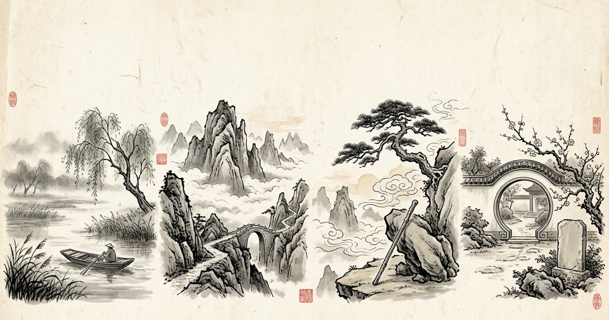
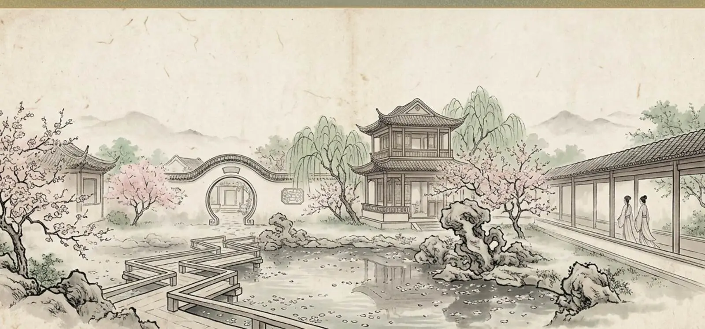

# Chinese Literature

### The Four Great Chinese Novels, as lookup tools

[Open the website](https://dreamofxm.github.io/chinese-literature/) · [Water Margin](https://dreamofxm.github.io/chinese-literature/water-margin/) · [Journey to the West](https://dreamofxm.github.io/chinese-literature/journey-west/) · [Red Chamber](https://dreamofxm.github.io/chinese-literature/red-chamber/)



<p align="center">
  
  
  
</p>

<p align="center"><em>Explore famous Chinese novels through searchable tables, character leaves, demon indexes and family trees.</em></p>

Chinese Literature is a free English reference site for the classical Chinese canon. It is designed for readers who want to look something up quickly, discover a character, or understand the world of a novel without searching through a long essay.

## Read online

The website is already published on GitHub Pages. **Readers do not need Node.js, npm or any local build step.** Just open the online site:

**[https://dreamofxm.github.io/chinese-literature/](https://dreamofxm.github.io/chinese-literature/)**

| Section | Explore |
|---|---|
| [Water Margin](https://dreamofxm.github.io/chinese-literature/water-margin/) | The 108 Stars in rank order, with Chinese and English nicknames, names, condensed fates and painted character leaves. |
| [Journey to the West](https://dreamofxm.github.io/chinese-literature/journey-west/) | Named demons, treasures, powers, locations, chapter ranges and how each encounter ends. |
| [Red Chamber](https://dreamofxm.github.io/chinese-literature/red-chamber/) | The Jia family tree, the Jinling register, verses, glosses, fates and character leaves. |
| Three Kingdoms | Planned as the fourth section. |

## Why use it

- Searchable reference pages instead of long summaries
- Character names shown in English and Chinese
- Ranked tables, indexes, family trees and painted leaves
- Built from public-domain texts
- Interpretive English notes clearly separated from the original text

## For contributors

The site is generated from plain HTML and JavaScript. There is no runtime data fetch: `render.mjs` contains the page builders and `build.mjs` generates the static pages, `robots.txt` and `sitemap.xml`.

These commands are only for contributors or anyone who wants to preview or rebuild the site locally:

```bash
node build.mjs
python3 -m http.server 8790
```

The local preview is for development only. It is not required to read the published website.

## Corrections

Open an issue. Each entry points back to a chapter or source context, so corrections can be checked and incorporated into the page.

## License

There is currently no general open-source license for the site's content. The rankings, notes and ink illustrations are original to this site; the paintings are modern interpretations made for it in the Ming drinking-leaf tradition. No scan, studio still or game asset appears anywhere on the site. Republication requires attribution and a link back.
